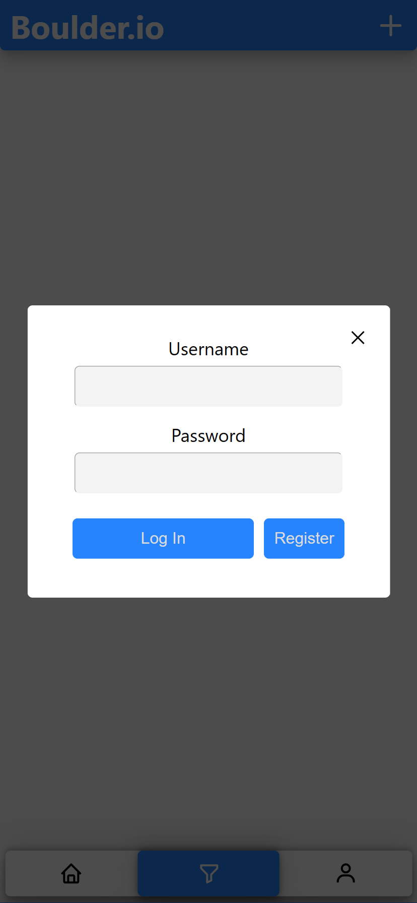
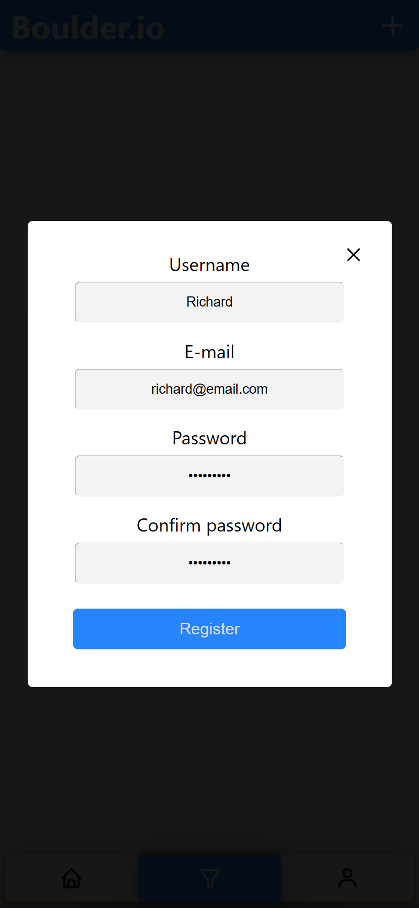
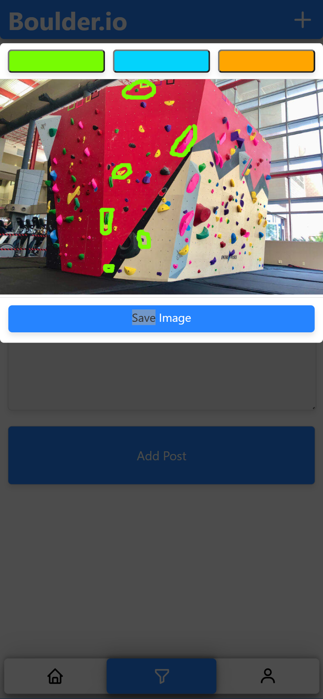
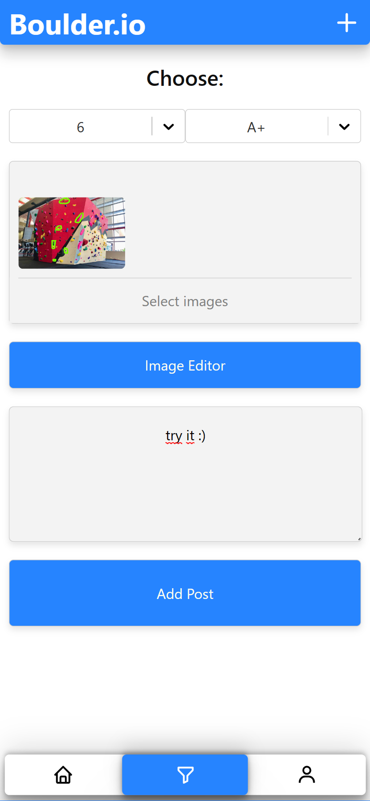
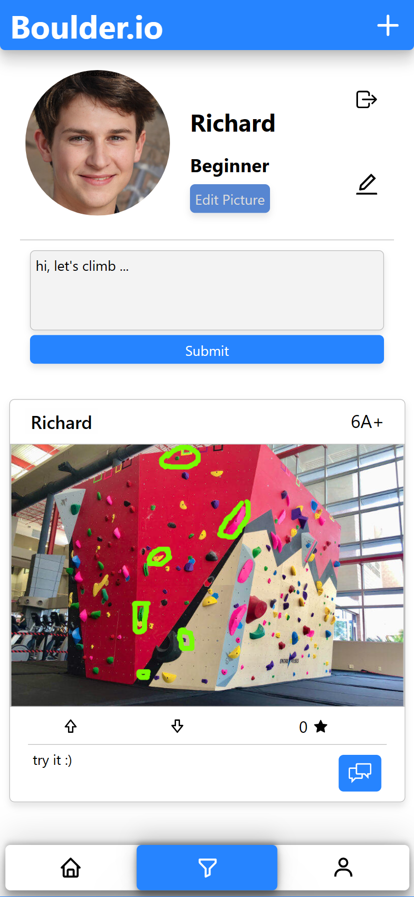
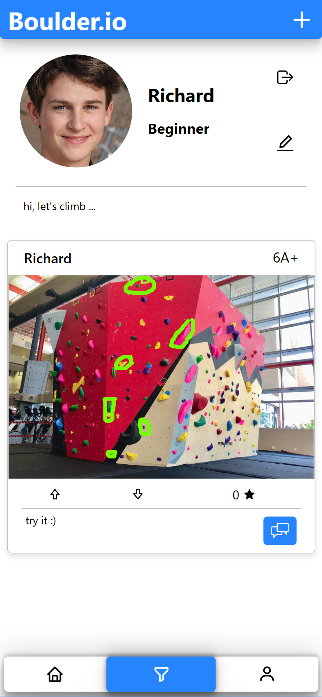
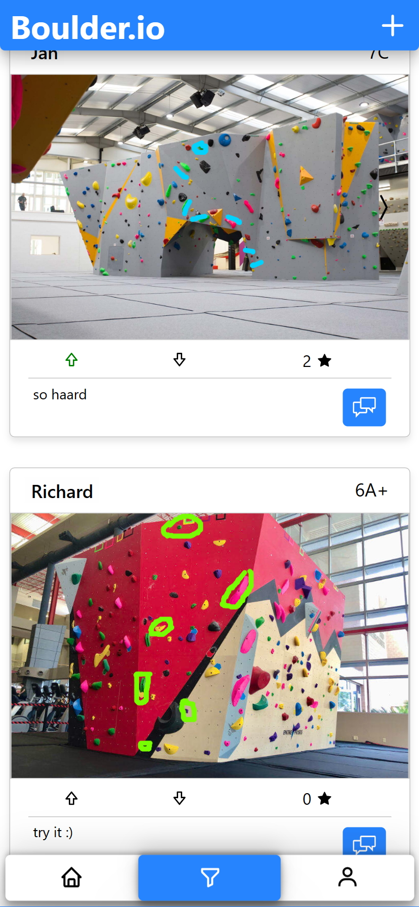
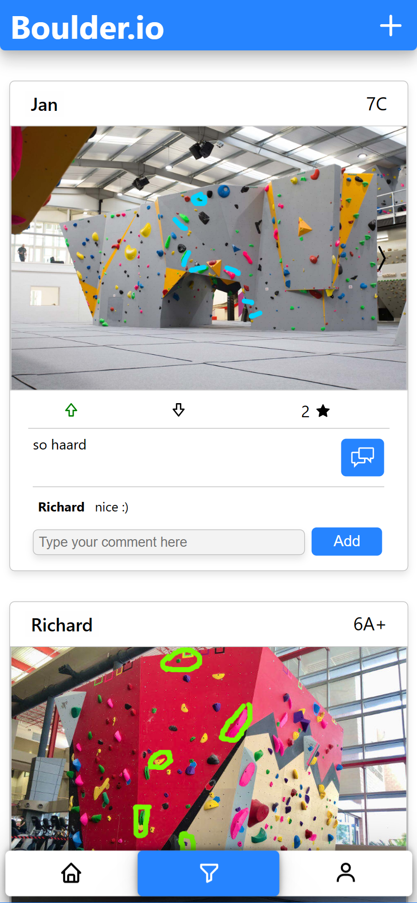
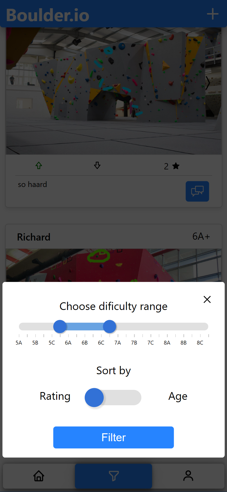

# Boulder.io

Boulder.io je webová aplikácia na vytváranie a zdeľanie lezeckých ciest. Primárne rieši problém vymýšľania vlastných ciest na stenách bez ich explicintého vyznačenia. Bola vytvorená pre predmet Tvorba používateľských rozhraní, ako skupinový projekt trojíc.

Prezeranie a filtrovanie ciest pre inšpiráciu pri lezení či už na domovskej stránke alebo profiloch iných používateľov je v aplikácii možné aj bez prihlásenia. Po prihlásení je možné pridávať príspevky s vymyslenými cestami, alebo aj hodnotiť a komentovať príspevky ostatných používateľov.

## Ukážky

|  |  |
|:--:|:--:|
| **1. Prihlásenie** | **2. Registrácia** |

|  |  |
|:--:|:--:|
| **3. Editor fotiek** | **4. Pridanie príspevku** |

|  |  |
|:--:|:--:|
| **5. Úprava používateľských údajov** | **6. Používateľský profil** |

|  |  |
|:--:|:--:|
| **7. Domovská stránka** | **8. Pridanie komentára** |

|  |  |
|:--:|:--:|
| **9. Filtrovanie príspevkov** |                     |
